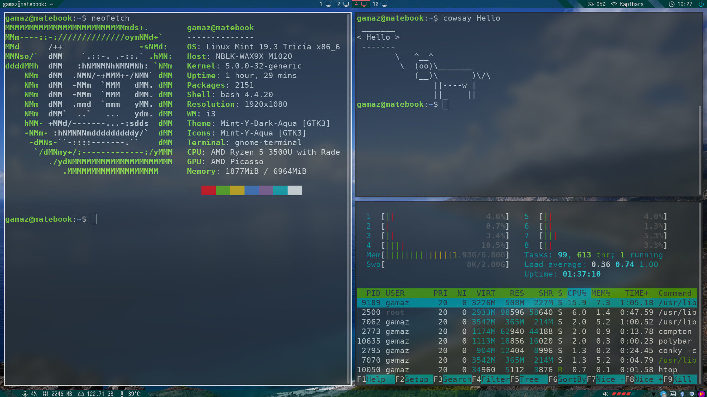

# install-i3-gaps-on-Mint
Step by step install i3-gaps, polybar, compton and other on Linux Mint 19.04 



i3wm is a convenient, minimalistic window Manager that is easy to configure as you wish.
I made a set of installation scripts for easy startup. I use fork i3-gaps instead of pure i3, because it seems more convenient to me. There are also many convenient additions to i3.

# Used Packages 

* i3-gaps - https://github.com/Airblader/i3 
* Polybar - https://github.com/polybar/polybar
* Compton - https://github.com/tryone144/compton.git
* Alternate-layout - https://github.com/olemartinorg/i3-alternating-layout
* ROFI - https://github.com/davatorium/rofi
* Variety
* Flameshot
* Conky
* Dunst Notification 

# Install

Clone this repository or download the archive. 
Each script has a number at the beginning of the name.
Then launch it .sh scripts in order. 

Go to the folder with the files
```
cd install-i3-gaps-on-Mint
```

Run script 1 to install git and snap
```
./0_install_git.sh
```

The following script sets all the necessary dependencies for i3
```
./1_dependencies.sh
```

Installing i3
```
./2_install_i3.sh
```

Installing programs for the I3 extension (Polybar, etc)
```
./3_programms_for_i3.sh
```

It remains to create config files for i3, Polybar, Conky, and Compton. Fonts are also copied
```
./4_create_config.sh
```

If you want, you can run the script with the number 5, it will install applications for you (Google Chrome, Telegram, Vim, Postman)
```
./4_install_apps.sh
```
